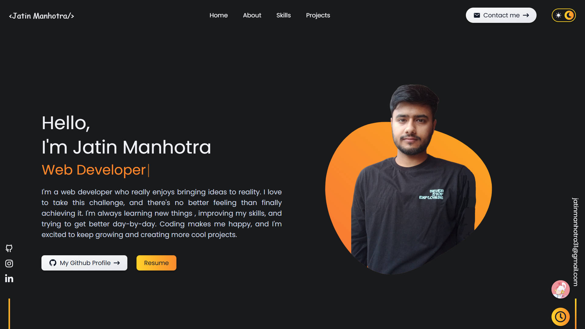
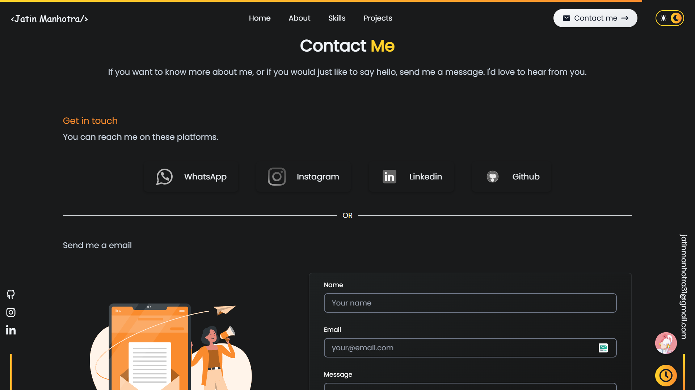

# 🌐 Jatin Manhotra's Developer Portfolio

A fully responsive and interactive portfolio website built using **React JS** and **Tailwind CSS** that showcases my skills, projects, and personality as a **front-end web developer**. It includes an AI Chatbot named Uta, real-time form validation, animated components, smooth page transitions, theme toggling, and integration with external APIs for real-world functionalities.

---

## 🚀 Live Demo

👉 Check out here - [Portfolio](https://jatinmanhotra.github.io/portfolio-2025)

---

## 📸 Screenshots

---

## 🔧 Tech Stack

- **React.js** - Component-based UI
- **React Router DOM** - Client-side routing
- **Tailwind CSS** - Utility-first CSS framework
- **React Icons** - Iconography
- **AOS (Animate on Scroll)** - Scroll-based animations
- **EmailJS** - Email form functionality without backend
- **Gemini API** - AI chatbot responses

---

## 🧩 Features

### 🎯 General Features
- 🌓 Light/Dark mode support (with localStorage)
- 💬 Integrated AI chatbot using Gemini API
- ✉️ Contact form with validation and animated popup on success/failure
- 🧩 Custom slider to showcase projects in cards. Each project opens on a dedicated route using React Router DOM.
- ✨ Smooth scroll and custom scroll progress bar
- 🕓 Live clock with day, date, and time
- 🔁 Fully responsive across all screen sizes
- 📥 Downloadable resume button
- 🔗 Links to social platforms like GitHub, LinkedIn, WhatsApp, Instagram

### 🧠 AI Chatbot - “Uta”
- 🤖 Powered by **Gemini API** (Gemini Flash 2.0)
- 🗨️ Real-time Q&A, designed to not save chat history, refreshing the page resets the conversation.

---

## 🌱 Future Ideas

- 🎖️ Add achievements, certificates, client projects sections.
- 🌐 Add a blog section to share tech content.
- 📊 Add dynamic charts showing skill levels / project stats.
- 🔍 Add a search bar for projects and blog filtering.
- 🗂️ Add project filtering by category or tech stack.
- 📱 PWA support for offline experience and mobile install.
- 🎙️ Voice input/output for Chatbot.
- 📤 Export Chat Option for Chatbot.
- 📬 Backend mail delivery (replacing EmailJS with NodeMailer/Express API).

---

## 📬 Contact

If you’d like to connect, reach out to me via:

- 🌐 [Portfolio](https://jatinmanhotra.github.io/portfolio-2025)
- 📧 Email: jatinmanhotra31@gmail.com
- 💬 WhatsApp: [Click to chat](https://wa.me/918493912066?text=Hi%20there%2C%20I%20saw%20your%20portfolio!)
- 💼 [LinkedIn](https://www.linkedin.com/in/jatin-manhotra-5b474a347/)
- 📷 [Instagram](https://www.instagram.com/manhotra.31/)
- 💻 [GitHub](https://github.com/JatinManhotra)